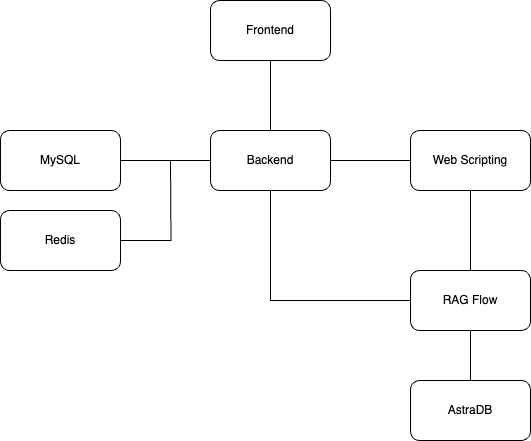

<h2>AEGIS</h2>

<h4>Team Members:</h4>
<ul>
  <li>Kyle Glover</li>
  <li>Ruixiang Huang</li>
  <li>Spencer Davis</li>
  <li>Terin Ambat</li>
</ul>

<h4>Project Description</h4>
<ul>
  <li>OSINT vulnerability and thread detection application</li>
  <li>Helps mitigate the issue of continuous vunerability analysis for ever-changing software</li>
  <li>Web scrapes the National Vulnerability Database to find and display CVEs relevant to your tech stack, and uses AI to suggest actionable improvements</li>
</ul>

<h4>Tech Stack</h4>
<ul>
  <li>Frontend: React</li>
  <li>Backend: Spring Boot</li>
  <li>Web Scripting: Flask, AstraDB, Langflow</li>
  <li>Database: MySQL, Redis</li>
  <li>Deployment: Docker</li>
</ul>

#### Deployment Architecture

<h4>Setup</h4>
<ul>
  <li>Create your Redis and MySQL databases, and update the application.yml file with their configurations</li>
  <li>Set up the RAG</li>
  <li>Navigate to the project directory and run docker compose up</li>
</ul>

<h4>User Process Flow</h4>
<ul>
  <li>Logs in with 2FA</li>
  <li>Uploads package.json from application</li>
  <li>Backend gets list of technologies and dependencies from package. json</li>
  <li>Backend web scrapes National Vulnerability Database to get latest CVEs for each tech and uploads to AstraDB</li>
  <li>Backend receives relevant CVEs from Langflow and sends to Frontend to display</li>
  <li>Gets email once file is processed</li>
  <li>Frontend sorts technologies by severity score with links specific CVE vulnerabilities</li>
</ul>
